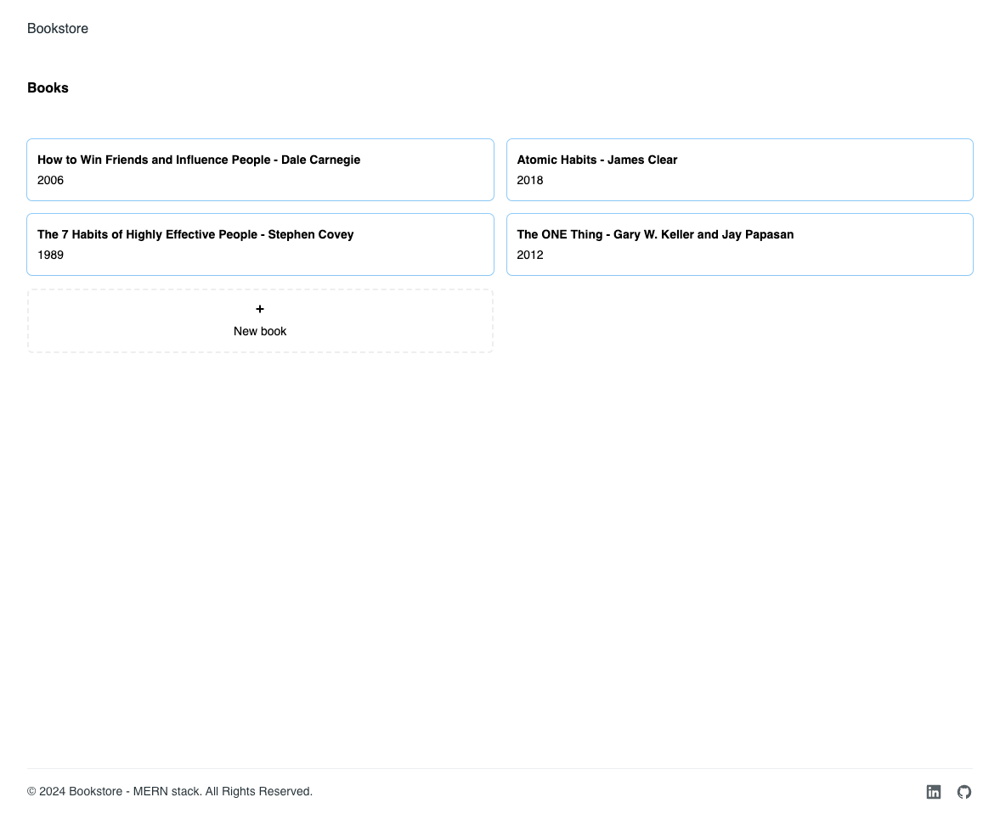
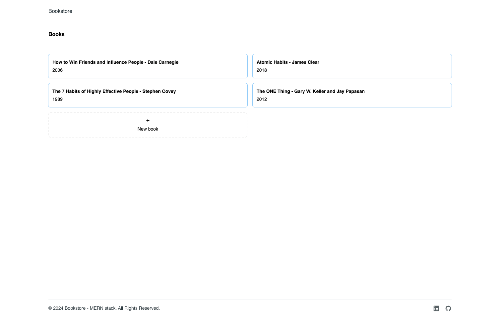
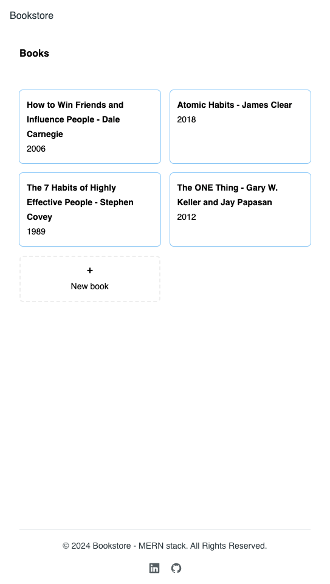

 <h2>About the project</h2>

   
A <b>bookstore</b>. Created with the MERN stack. 

 <h3>Build with:</h3>

» Typescript
» React JS
» TailwindCSS
» Tailwind - Material UI

 <h3>Tools:</h3>

» Vite
» Nodemon

 <h3>Backend:</h3>
    * Mongo
    * Express
    * Node JS

 <h3>Frontend:</h3>
    * React

### Getting Started

- Create free mongo db account https://www.mongodb.com/
- Create env file, see sample env file.

## Frontend

`npm i`
`npm run dev`

## Backend

`npm i`
`npm run start`

 <h2>Screenshots of the Project 📸</h2>
  
 

 <h3>Desktop</h3>
 

 <h3>Mobile</h3>
 

